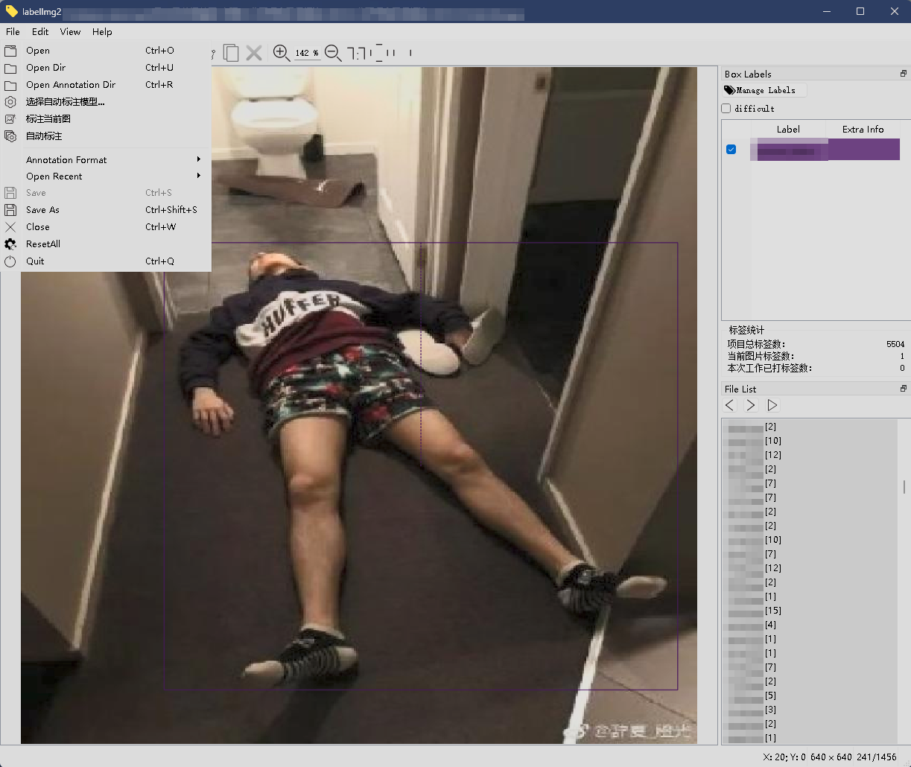

# LabelImg2 Custom

简体中文主页 | [English](README.rst)

这是基于 [chinakook/labelImg2](https://github.com/chinakook/labelImg2) 的独立维护派生项目，主要针对高频 YOLO OBB 标注工作优化操作流程。原项目的 MIT License 和版权声明完整保留；包含自动标注功能的当前整体发行版采用 GNU AGPL v3.0。

第一次接触本项目，建议从这里开始：

> [小白首次下载、安装与完整标注流程](FIRST_USE_GUIDE_zh-CN.md)

更完整的功能说明见：[中文详细说明](README_zh-CN.md)。

## 界面预览



## 下载与安装

[下载 Windows 安装包 v2.5.2（64 位 EXE）](https://github.com/auto-sun/labelImg2-custom/releases/download/v2.5.2/LabelImg2Custom-2.5.2-Setup.exe)

双击安装后从开始菜单启动即可，无需配置 Python、Conda 或其他运行环境。
安装包包含 CPU 版模型推理依赖，但不包含 `.pt` 模型权重；自动标注时请选择自己的模型。
安装包未提供代码签名，Windows 可能显示“未知发布者”。
历史修改记录见 [更新日志](CHANGELOG.md)；以本页链接指向的版本为最新推荐版。

## 主要改进

- 自动恢复上次打开的图片目录、当前进度、标签目录、保存格式和默认类别。
- 工具栏在较窄窗口自动分行，设置窗口随屏幕大小调整；文件和文件夹选择使用 Windows 原生窗口。
- 图片文件名按照自然数字顺序排列，例如 `1、2、10、20`。
- 支持相同子目录结构的图片与标签递归匹配。
- 可从 `File` 菜单或右侧 `Box Labels` 选择、预览并切换任意 `class.txt`，自动保留最近使用历史。
- 一万级 labels 目录采用分批读取，文件列表立即显示，标签数量与格式在不阻塞界面的情况下逐步更新。
- 可以直接保存 Pascal VOC XML、Ultralytics YOLO 或 Ultralytics YOLO OBB。
- 上方“生成空标签”可按当前格式为当前图片创建空 XML/TXT；已有框时先确认，完成后显示 `[BG]`，并支持 `Ctrl+Z` 恢复。
- 手动切换 `Annotation Format` 会批量转换当前数据集的已有标签并显示进度；转换成功后移除旧格式，失败时保留原文件。
- 打开标签目录后自动识别 XML、YOLO 5 列 TXT、YOLO OBB 9 列 TXT 和空背景 TXT。
- 支持本地 YOLO/YOLO OBB `.pt` 模型批量自动标注，自动切换输出格式并把模型类别
  模糊匹配到项目类别预设。
- 上方工具栏可调整模型置信度阈值（`0.01–1.00`），批量和单张标注共用并自动记住设置。
- 自动标注类别完整同名时强制优先，避免 `pipe_row` 因共享单词误匹配到 `Drill_pipe`。
- 自动标注在后台运行，状态栏显示进度并提供中止按钮；已有 XML/TXT 不会被覆盖。
- 顶部“标注当前图”只推理当前图片；已有标签时可选择覆盖、直接添加或取消。
- 单张模型标注完成后可按 `Ctrl+Z` 整体撤销，再按 `Ctrl+S` 保存恢复结果。
- 工具栏选择普通框或 OBB 后，按 `E` 进入或退出对应类型的绘制；原有画框按钮仍可直接使用。
- 可在右侧 `Box Labels` 配置多个“快捷键 → class.txt 预设类别”；按键后直接绘制一次对应类别的 OBB，并自动记住设置。
- 常用类别优先，减少同首字母类别的重复查找。
- 支持框的复制粘贴、跨图片原位置粘贴、框选多选、整体移动和批量删除。
- 右侧实时显示项目总标签数、当前图片标签数和本次启动后新增标签净数量；新增、删除及撤销都会同步更新。
- `View > Auto Saving` 首次启动默认开启，并会记住之后的手动选择。
- 未选框时滚轮缩放图片；选中框时滚轮只调整框大小。
- `Alt + 鼠标左键拖动`平移画布。
- 未开启自动保存时，切换含未保存修改的图片会先弹出确认提示。

## 首次使用

安装完成后，在 `File > 选择类别文件...` 中选择项目自己的 `class.txt`，
确认预览中的类别名称和顺序。类别编号从 `0` 开始；正式标注后不要随意交换顺序。
完整操作步骤见 [小白首次使用流程](FIRST_USE_GUIDE_zh-CN.md)。

## 推荐的 YOLO OBB 流程

1. 使用 `File > Open Dir` 选择图片根目录。
2. 使用 `File > Open Annotation Dir` 选择标签根目录。
3. 在 `File > Annotation Format` 中选择 `Ultralytics YOLO OBB`；已有标签会显示进度并批量转换。
4. 建议在 `View` 菜单开启 `Auto Saving`。
5. 在工具栏选择“框型：OBB”，按 `E` 绘制旋转框，画完后直接输入类别首字母。
6. 使用 `Z / X / C / V / F` 调整角度，选中框时滚轮调整大小。
7. 按 `Ctrl+S` 保存，使用 `D` 或下方向键进入下一张。

## 模型自动标注

1. 使用 `Open Dir` 打开需要预标注的图片根目录。
2. 使用 `Open Annotation Dir` 选择标签输出根目录。
3. 在模型按钮旁调整“置信度”数值；默认 `0.25`，数值越高通常保留的预测框越少。
4. 点击工具栏“自动标注”；第一次使用时选择本地 YOLO/YOLO OBB `.pt`。
5. OBB 模型会自动切换到 YOLO OBB，并生成 9 列 `.txt`；普通检测模型生成
   5 列 YOLO `.txt`。
6. 状态栏显示当前图片、总体进度和本次置信度，需要停止时点击“中止”。
7. 完成后检查类别映射和相似度，并人工复核所有模型框。

如果只需要重新推理正在查看的图片，点击顶部“标注当前图”。当前图片已有框或标签文件时，
程序会询问：

- `覆盖原标签`：只保留本次模型生成的框；
- `直接添加`：保留当前框，再加入模型生成的框；
- `取消`：不运行模型，也不修改标签。

普通“自动标注”仍是批量模式，只处理尚无 XML/TXT 的图片，不覆盖已有人工标签。
两种模式共用工具栏中的置信度，范围为 `0.01–1.00`、默认 `0.25`，修改后下次启动
仍然生效。模型结果保存为 YOLO/YOLO OBB TXT，同名 XML 不会被自动删除。
单张模式完成后可按 `Ctrl+Z` 撤销整次模型结果，再按 `Ctrl+S` 写回恢复后的标签。
项目不附带模型权重，请只使用自己训练或获得合法授权的 `.pt` 文件。

## 常用快捷键

| 快捷键 | 功能 |
| --- | --- |
| `E` | 按工具栏当前选择的普通框或 OBB 类型进入/退出绘制 |
| `Ctrl+S` | 保存当前标签 |
| `A / D` | 上一张 / 下一张 |
| `上 / 下方向键` | 上一张 / 下一张（选中框时用于上下微调） |
| `四个方向键（已选框）` | 将选中框向对应方向微调 1 像素 |
| `Ctrl+C / Ctrl+X / Ctrl+V` | 复制 / 剪切 / 粘贴选中框 |
| `Ctrl+Z` | 撤销上一步框操作（每张图片最多 50 步） |
| `Ctrl+D` | 直接复制选中框 |
| `Delete` | 删除全部选中框 |
| `Alt + 左键拖动` | 平移画布 |
| `Ctrl+R` | 打开标签读取与保存目录 |
| `Ctrl+Shift+L` | 显示或隐藏框上的标签文字 |

自定义标签键不写死在本表中：点击右侧 `Box Labels` 的“标签快捷键设置...”，例如把
`1` 绑定到 `SafeHat`。程序只允许选择当前 `class.txt` 中的类别，并会拒绝与现有功能或
其他自定义映射冲突的键位。保存后按 `1` 即可直接进入一次 `SafeHat` 的 OBB 绘制状态，
设置会在下次启动时自动恢复。

双击已有框的类别后，可输入中文类别的拼音（例如 `huolongguo` 查找“火龙果”），
或按已设置的类别快捷键直接修改当前框。右侧 File List 右键可将暂时无法确定类别的图片
标记为淡红色“待确认”；再次右键可取消标记，刷新或重启后标记仍在。中文输入法开启时，
画布和这些快捷键控件仍可直接接收按键。

## 标签目录匹配示例

选择 `images` 作为图片根目录、`labels` 作为标签根目录后：

```text
images/site_a/day/001.jpg
```

会自动对应：

```text
labels/site_a/day/001.xml
labels/site_a/day/001.txt
```

## 许可证与项目来源

当前整体发行版遵循 [GNU Affero General Public License v3.0](LICENSE)。
原始 LabelImg2 代码仍保留其 [MIT License 和版权声明](LICENSE-MIT-UPSTREAM)。
在满足上游 MIT 声明的基础上，本修改版及其与 Ultralytics 自动标注功能组成的整体按
AGPL-3.0 免费开源发布。

- 原项目：<https://github.com/chinakook/labelImg2>
- 当前整体许可证：[GNU AGPL v3.0](LICENSE)
- 上游原始许可证：[MIT License](LICENSE-MIT-UPSTREAM)
- 中文来源说明：[NOTICE_zh-CN.md](NOTICE_zh-CN.md)
- 修改功能清单：[MODIFICATIONS_zh-CN.md](MODIFICATIONS_zh-CN.md)

本仓库是独立维护的修改版，不代表上游项目的官方发布。
